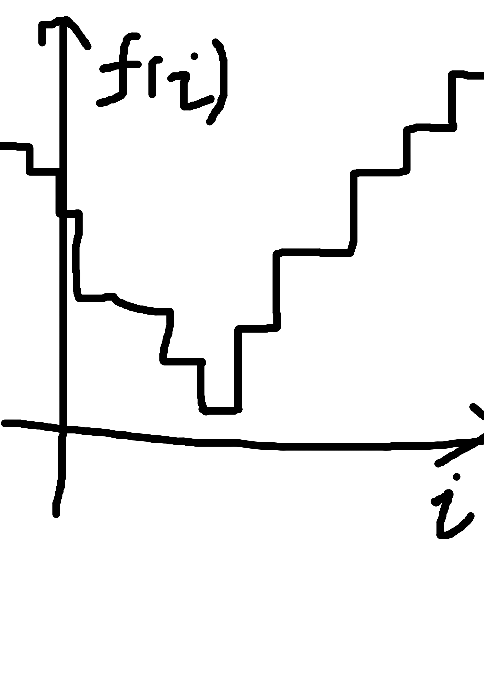

This year is my first year doing the [Advent of Code](https://adventofcode.com/2021) challenge, and today (2021 Day 7)'s challenge is a fun one.

<!-- end -->

I won't go to the details, but the problem involves finding the minimum for a function. The function takes an integer and returns another integer. An interesting property of that function is that it has one "valley": Everything at the left of the global minimal point monotonically decreases. Everything at the right of the global minimal point monotonically increases.

<div class="right-image-container">
  
</div>

You can think the function output as a bunch of integers like

```
100, 81, 56, 32, 16, 33, 44, 78, 129
```

And we want to find out the value 16.

Naively we can evaluate the function at every point in the domain and then find the minimum,
and a slightly better way is to evaluate the function until we find where the result starts to increase.
Both strategies requires `O(n)` time, but since our data are nicely "sorted," we can do better.

## Ternary Search

Ternary Search, similar to binary search, expliots our data's pattern, and can achieve `O(log n)` asymptotic time.
Wikipedia describe it as a technique for "finding the minimum or maximum of a unimodal function," which is exactly the function we want to solve. The basic idea is simple: if we partition our domain into three segment by two point: `left` and `right`, then we can evaluate the function at `left` and `right` and get several cases:

- `f(left) < f(right)`
- `f(left) > f(right)`
- `f(left) == f(right)`

If `f(left) < f(right)`, which means either both `left` and `right` points are greater than the position of the local minimum, or `left` is less than the position of local minimum and `right` is greater than the position of local minimum. In either case, we know that the local minimum is not at the right hand side of `right`, so we can discard that part of the domain.

If `f(left) > f(right)`, similarly we can discard the left hand side of `left`. And if `f(left) == f(right)`, we can discard both side and only keep the range `[left, right]`.

We can equally trisect the domain into `left` and `right`, and then we can run the above process recursively or iteratively to solve the problem. We still need a terminate condition: since our `left` and `right` can be stuck if `right - left <= 2`, we stop there and then fall back to linear search. And we can have the following pseudocode:

```
var left = domain.min
var right = domain.max
while (right - left) > 3 {
  let left_third = left + (right - left) / 3
  let right_third = right - (right - left) / 3

  if f(left_third) < f(right_third) {
    right = right_third
  } else {
    left = left_third
  }
}

for i in left until right get the smallest f(i)
```

It is an elegent and fun algorithm, and I am suprised that today is the first time I hear about it.
And hopefully now you also understand how and when to use this algorithm.
