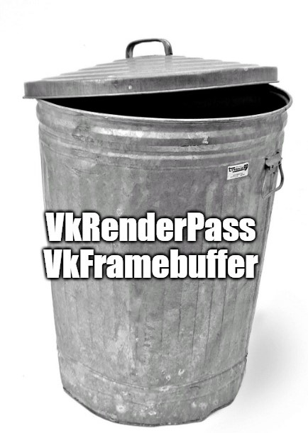

[Announced two months ago](https://www.khronos.org/blog/streamlining-render-passes), the [dynamic rendering](https://www.khronos.org/registry/vulkan/specs/1.2-extensions/man/html/VK_KHR_dynamic_rendering.html) Vulkan extension promises to get rid of the `VkRenderPass` and `VkFramebuffer` objects, which were parts of Vulkan that I "don't understand and don't really care about."

<!-- end -->

<div class="right-image-container">
  
</div>

To write a Vulkan renderer before the advent of dynamic rendering, we always needed to write a lot of boilerplate renderpass code.
It is not an ergonomic API, nor is it often that we need the flexibility of multiple subpasses or input attachments.
By contrast, the DirectX 12 API has render passes as an optional thing that is only used to "improve performance if the renderer is Tile-Based Deferred Rendering."

Recently, I started writing a new Vulkan Renderer from scratch in Rust using the [ash crate](https://github.com/MaikKlein/ash), and it was natural for me to try this shiny new dynamic rendering extension.
The resources on this extension are still sparse, and there is no tutorial on using it.
There is [Sascha Willems' example](https://github.com/SaschaWillems/Vulkan/blob/313ac10de4a765997ddf5202c599e4a0ca32c8ca/examples/dynamicrendering/dynamicrendering.cpp), though I only found it after I implemented dynamic rendering myself.

I ended up just reading the [extension spec](https://www.khronos.org/registry/vulkan/specs/1.2-extensions/man/html/VK_KHR_dynamic_rendering.html), which is readable enough to figure out its usage.
I write this post, however, in a more tutorial-style approach to show how to use this extension.
To make the post more accessible, I write it using the original C-API instead of the Rust bindings.
It is good that the bindings in the `ash` crate are a straightforward mapping to the C-API, but if I made a mistake in code snippets during the "translation" process, please get in touch with me.

## Initialization

`VK_KHR_dynamic_rendering` is a device extension, so when we create our logical device, we need to enable it with other device extensions such as `VK_KHR_swapchain`.

### Check extension availability

Like all other extensions, we can check whether our physical device supports `VK_KHR_dynamic_rendering` via `vkEnumerateDeviceExtensionProperties`. If the result we get from `vkEnumerateDeviceExtensionProperties` doesn't contain `VK_KHR_dynamic_rendering`, we will need to update the driver and [Vulkan SDK and runtime](https://vulkan.lunarg.com/sdk/home).

**Note**: `VK_KHR_dynamic_rendering` is young at the time of this writing (January 2021), so there is a possibility that the latest driver on your hardware still doesn't support it.
When I wrote this article, I needed to install a ["Vulkan Beta Driver"](https://developer.nvidia.com/vulkan-driver) for my Nvidia card, though this is no longer the case now.

### Enable feature and load the extension

Before we create our logical device, we also need to add `VK_KHR_dynamic_rendering` to our extension lists:

```cpp
std::vector<const char*> device_extensions = {
  // ...,
  "VK_KHR_dynamic_rendering"
};
```

Additionally, dynamic rendering is hidden behind a feature flag, and we need to create a `VkPhysicalDeviceDynamicRenderingFeaturesKHR` structure and then pass it to the `pNext` chain when we create the logical device:

```cpp
constexpr VkPhysicalDeviceDynamicRenderingFeaturesKHR dynamic_rendering_feature {
    .sType = VK_STRUCTURE_TYPE_PHYSICAL_DEVICE_DYNAMIC_RENDERING_FEATURES_KHR,
    .dynamicRendering = VK_TRUE,
};

const VkDeviceCreateInfo device_create_info = {
    .sType = VK_STRUCTURE_TYPE_DEVICE_CREATE_INFO,
    .pNext = &dynamic_rendering_feature,
    // ...
    .enabledExtensionCount = static_cast<unsigned int>(device_extensions.size()),
    .ppEnabledExtensionNames = device_extensions.data(),
};
```

<aside style="margin-top: -90px;">

If you are using C++, I recommend giving [vk-bootstrap](https://github.com/charles-lunarg/vk-bootstrap) library a try.
It will make the initialization process a bit smoother.

</aside>

## Use dynamic rendering in command buffer
In your Vulkan renderer, you are likely to have code that looks like the following in your command buffer recording:

```cpp
VK_CHECK(vkBeginCommandBuffer(command_buffer, &command_buffer_begin_info));

VkRenderPassBeginInfo render_pass_begin_info = {
    // ...
};

vkCmdBeginRenderPass(command_buffer, &render_pass_begin_info, VK_SUBPASS_CONTENTS_INLINE);

// Draw calls here

vkCmdEndRenderPass(command_buffer);

VK_CHECK(vkEndCommandBuffer(command_buffer));
```

With dynamic rendering, we need to replace the `VkRenderPassBeginInfo` structure and the `vkCmdBeginRenderPass` and `vkCmdEndRenderPass` calls.
Instead of using `VkRenderPassBeginInfo`, we add a [`VkRenderingInfoKHR`](https://www.khronos.org/registry/vulkan/specs/1.2-extensions/man/html/VkRenderingInfoKHR.html) structure, which looks like the following:

```cpp
typedef struct VkRenderingInfoKHR {
    VkStructureType                        sType;
    const void*                            pNext;
    VkRenderingFlagsKHR                    flags;
    VkRect2D                               renderArea;
    uint32_t                               layerCount;
    uint32_t                               viewMask;
    uint32_t                               colorAttachmentCount;
    const VkRenderingAttachmentInfoKHR*    pColorAttachments;
    const VkRenderingAttachmentInfoKHR*    pDepthAttachment;
    const VkRenderingAttachmentInfoKHR*    pStencilAttachment;
} VkRenderingInfoKHR;
```

You can see that some fields, like `renderArea`, were previously provided to `VkRenderPassBeginInfo`.
Still, the majority of the information of this structure would be provided as a part of render pass creation.
In particular, we have this new [`VkRenderingAttachmentInfoKHR`](https://www.khronos.org/registry/vulkan/specs/1.2-extensions/man/html/VkRenderingAttachmentInfoKHR.html) structure instead of [`VkAttachmentDescription`](https://www.khronos.org/registry/vulkan/specs/1.2-extensions/man/html/VkAttachmentDescription.html) to describe attachments:

```cpp
typedef struct VkRenderingAttachmentInfoKHR {
    VkStructureType          sType;
    const void*              pNext;
    VkImageView              imageView;
    VkImageLayout            imageLayout;
    VkResolveModeFlagBits    resolveMode;
    VkImageView              resolveImageView;
    VkImageLayout            resolveImageLayout;
    VkAttachmentLoadOp       loadOp;
    VkAttachmentStoreOp      storeOp;
    VkClearValue             clearValue;
} VkRenderingAttachmentInfoKHR;
```

Now we can replace our render pass code with the usage of the above structures.
This change does mean that we will write more code in our command buffer recording, as some of the information we provided to render pass object are moved to here:

```cpp
VK_CHECK(vkBeginCommandBuffer(command_buffer, &command_buffer_begin_info));

const VkRenderingAttachmentInfoKHR color_attachment_info {
    .sType = VK_STRUCTURE_TYPE_RENDERING_ATTACHMENT_INFO_KHR,
    .imageView = swapchain_image_views_[swapchain_image_index_],
    .imageLayout = VK_IMAGE_LAYOUT_ATTACHMENT_OPTIMAL_KHR,
    .loadOp = VK_ATTACHMENT_LOAD_OP_CLEAR,
    .storeOp = VK_ATTACHMENT_STORE_OP_STORE,
    .clearValue = clear_value,
};

const VkRenderingInfoKHR render_info {
    .sType = VK_STRUCTURE_TYPE_RENDERING_INFO_KHR,
    .renderArea = render_area,
    .layerCount = 1,
    .colorAttachmentCount = 1,
    .pColorAttachments = &color_attachment_info,
};

vkCmdBeginRenderingKHR(command_buffer, &render_info);

// Draw calls here

vkCmdEndRenderingKHR(command_buffer);

VK_CHECK(vkEndCommandBuffer(command_buffer));
```

## Pipeline creation

Now we are at the point where we can scrape out all of the code initializing render pass and framebuffer objects! And when creating pipeline objects, we no longer need to specify a render pass, but instead, we need to create a [`VkPipelineRenderingCreateInfoKHR`](https://www.khronos.org/registry/vulkan/specs/1.2-extensions/man/html/VkPipelineRenderingCreateInfoKHR.html) object to specify attachment formats:

```cpp
const VkPipelineRenderingCreateInfoKHR pipeline_rendering_create_info {
    .sType = VK_STRUCTURE_TYPE_PIPELINE_RENDERING_CREATE_INFO_KHR,
    .colorAttachmentCount = 1,
    .pColorAttachmentFormats = &swapchain_image_format_,
};

const VkGraphicsPipelineCreateInfo pipeline_create_info {
  // ...
  .pNext = &pipeline_rendering_create_info,
  // ...
  .renderPass = nullptr, // We no longer need a render pass
  // ...
};
```

## Image layout transition

If everything were that simple, I would be very pleased with this extension.
However, it turns out that the render pass object was doing something useful. 

With our current code, the validation layer produces this warning every frame:

> pSwapchains[0] images passed to present must be in layout VK_IMAGE_LAYOUT_PRESENT_SRC_KHR or VK_IMAGE_LAYOUT_SHARED_PRESENT_KHR but is in VK_IMAGE_LAYOUT_UNDEFINED. The Vulkan spec states: Each element of pImageIndices must be the index of a presentable image acquired from the swapchain specified by the corresponding element of the pSwapchains array, and the presented image subresource must be in the VK_IMAGE_LAYOUT_PRESENT_SRC_KHR layout at the time the operation is executed on a VkDevice (https://github.com/KhronosGroup/Vulkan-Docs/search?q=VUID-VkPresentInfoKHR-pImageIndices-01296)

It says that our swapchain image is in `VK_IMAGE_LAYOUT_UNDEFINED` layout, but to present the image, it should be in either `VK_IMAGE_LAYOUT_PRESENT_SRC_KHR` or `VK_IMAGE_LAYOUT_SHARED_PRESENT_KHR`.
We can manually transition the layout of swapchain image to `VK_IMAGE_LAYOUT_PRESENT_SRC_KHR` before presenting:

```cpp
// draw calls here

vkCmdEndRenderingKHR(command_buffer);

const VkImageMemoryBarrier image_memory_barrier {
    .sType = VK_STRUCTURE_TYPE_IMAGE_MEMORY_BARRIER,
    .srcAccessMask = VK_ACCESS_COLOR_ATTACHMENT_WRITE_BIT,
    .oldLayout = VK_IMAGE_LAYOUT_COLOR_ATTACHMENT_OPTIMAL,
    .newLayout = VK_IMAGE_LAYOUT_PRESENT_SRC_KHR,
    .image = swapchain_images[swapchain_image_index_],
    .subresourceRange = {
      .aspectMask = VK_IMAGE_ASPECT_COLOR_BIT,
      .baseMipLevel = 0,
      .levelCount = 1,
      .baseArrayLayer = 0,
      .layerCount = 1,
    }
};

vkCmdPipelineBarrier(
    command_buffer,
    VK_PIPELINE_STAGE_COLOR_ATTACHMENT_OUTPUT_BIT,  // srcStageMask
    BOTTOM_OF_PIPE, // dstStageMask
    0,
    0,
    nullptr,
    0,
    nullptr,
    1, // imageMemoryBarrierCount
    &image_memory_barrier // pImageMemoryBarriers
);

VK_CHECK(vkEndCommandBuffer(command_buffer));
```

But now `VK_IMAGE_LAYOUT_PRESENT_SRC_KHR` is not a layout fit for rendering in the next frame.
So before rendering, we need to transition the image back into `VK_IMAGE_LAYOUT_COLOR_ATTACHMENT_OPTIMAL`:

```cpp
VK_CHECK(vkBeginCommandBuffer(command_buffer, &command_buffer_begin_info));

const VkImageMemoryBarrier image_memory_barrier {
    .sType = VK_STRUCTURE_TYPE_IMAGE_MEMORY_BARRIER,
    .dstAccessMask = VK_ACCESS_COLOR_ATTACHMENT_WRITE_BIT,
    .oldLayout = VK_IMAGE_LAYOUT_UNDEFINED,
    .newLayout = VK_IMAGE_LAYOUT_COLOR_ATTACHMENT_OPTIMAL,
    .image = swapchain_images[swapchain_image_index_],
    .subresourceRange = {
      .aspectMask = VK_IMAGE_ASPECT_COLOR_BIT,
      .baseMipLevel = 0,
      .levelCount = 1,
      .baseArrayLayer = 0,
      .layerCount = 1,
    }
};

vkCmdPipelineBarrier(
    command_buffer,
    VK_PIPELINE_STAGE_TOP_OF_PIPE_BIT,  // srcStageMask
    VK_PIPELINE_STAGE_COLOR_ATTACHMENT_OUTPUT_BIT, // dstStageMask
    0,
    0,
    nullptr,
    0,
    nullptr,
    1, // imageMemoryBarrierCount
    &image_memory_barrier // pImageMemoryBarriers
);

// begin dynamic rendering here

// draw calls
```

Almost all Vulkan renderers have helper functions for these image layout transition functions to reduce verbosity,
but it is still quite a hassle to specify all the parameters.
And we also need to do a similar layout transition dance for the depth buffer and stencil buffer, with access masks, pipeline stage masks, and layout changes accordingly.

## Final word

In this simple case, the dynamic rendering extension seems almost as verbose as creating render passes and framebuffer objects.
Though I can see that dynamic rendering becomes more valuable in multi-pass rendering, whereas synchronization becomes complicated with the traditional render pass approach.
Khronos may also improve the ergonomics of dynamic rendering somehow in the future.

## Acknowledgements
Special thanks to my friend [Charles Giessen](https://twitter.com/charlesgiessen) for proofreading and editing this post!

After this post was initially released, many experienced graphics programmers provided valuable insight and feedback.
[Jeremy Ong](https://www.jeremyong.com/) provides insightful [Twitter](https://twitter.com/m_ninepoints/status/1482620618549776389) feedback on this post that I very much recommend reading.
[Karn Kaul](https://github.com/karnkaul) mentioned that it would be more precise if I said that image layout transition for depth buffer is slightly different from color buffers. And he also noted that on some hardware and drivers, using the automatic image layout transition provided by render pass causes artifacts, and manual image layout transition is the only way anyway.
[Leon Brands](https://leonbrands.software/) points out that the initial post didn't talk about pipelines, so I added a section about the change in pipeline creation.
And [Timmy](https://twitter.com/rex_timmy) on Twitter noted that Nvidia is now shipping VK_KHR_dynamic_rendering in their game-ready drivers.
