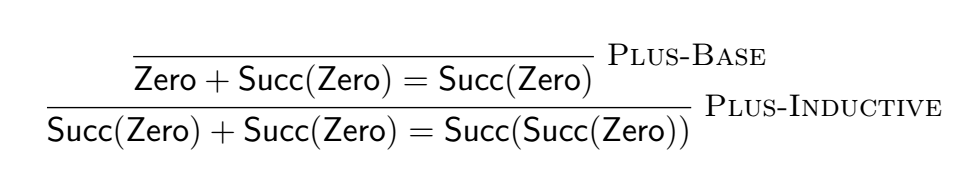

From a layperson's perspective, the field of programming language research is full of jargon, greek letters, and weird symbols.
On the one hand, Those common parlances make the programming language papers concise.
On the other hand, you need not only mathematical maturity but also domain knowledge to understand them.

Since I am taking a [Fundamentals of Programming Languages](https://csci5535.cs.colorado.edu/s20/) course,
I want to share the key concepts I learned in a series of blog posts.
And I hope to write them in a "mortal-understandable" way to unravel the mysterious field of programming languages.

I want to thank [Professor Chang](https://www.cs.colorado.edu/~bec/) for offering this fantastic course,
and my classmates for creating a vibrant discussion environment.
I also need to make a disclaimer that many ideas of those posts come from the classroom.
I would cite writing texts when apply, but it is impossible to cite in class discussions.
Of course, all errors are my own, and please contact me for anything wrong.

A lot of the mathematical concepts in the programming language field comes from the branch of [propositional logic](https://en.wikipedia.org/wiki/Propositional_calculus). Thus, this first post focuses on the formal language of _Judgements_, and _Inference Rules_.

## Judgements

A judgment is a statement or an assertion on a given abstract syntax tree.
Below are some standard notations we use for the judgments [^1]:

[^1]: Robert Harper. _Practical Foundations for Programming Languages_. Cambridge University Press, Cambridge, England, Second edition, 2016.

$$
\begin{aligned}
n \ \text{nat} && \text{$n$ is a natural number} \\
n_1 + n_2 = n && \text{$n$ is the sum of $n_1$ and $n_2$} \\
\tau \ \text{type} && \text{$\tau$ is type} \\
e : \tau && \text{expression $e$ evaluate to type $\tau$} \\
e \Downarrow v && \text{expression $e$ evaluate to value $v$}
\end{aligned}
$$

Notice in the above examples such as $n \ \text{nat}$,
$n$ is an unknown variable.
We call those _judgement forms_
And we can plug in actual values into the variables of judgement forms to get a _judgement_:

$$
\begin{aligned}
0 &\ \text{nat} \\
1 &\ \text{nat} \\
-1 &\ \text{nat} \\
\text{``Hello, world!''} &\ \text{nat}
\end{aligned}
$$

As we can see, judgments can either be true or false.
You can consider it is a function application that returns a `bool`.

## Inference Rules

Inference rules are a logic form that takes premises and returns conclusions.
They generally have the standard form of the following:

$$
\frac{\text{premise1} \quad \text{premise2} \quad \cdots}{ \text{conclusion} }
$$

You can read them as "if all the premises are satisfied, then the conclusion."

Let's inductively define the natural numbers by the inference rules.

$$
\frac{}{\text{zero} \ \text{nat} }
$$

$$
\frac{a  \ \text{nat}}{\text{Succ}(a) \ \text{nat} }
$$

In this inference rule, we state that a natural number is either zero
or a succession of another natural number.
A rule without any premise, such as the first one, is called an _axiom_.

Because using inference rule to describe syntax is verbose,
a common way to describe syntax is by [grammar](https://en.wikipedia.org/wiki/Context-free_grammar) notation
like the [Backus normal form](https://en.wikipedia.org/wiki/Backus%E2%80%93Naur_form) (BNF).
A grammar of a programming language is a set of inductively defined _terms_.
For example, for natural numbers, we can describe them as

$$
\text{\textbf{nat}} ::= \text{Zero} | \text{Succ}(\textbf{nat})
$$

However, inference rules can express much more than syntax. For example, let's define the semantics of the $+$ operator of the natural number:

$$
\frac{n: \text{\textbf{nat}}}{\text{Zero} + n \Downarrow n} (\text{Plus-Base})
$$

$$
\frac{n_1: \text{\textbf{nat}} \quad n_2: \text{\textbf{nat}} \quad n_1 + n_2 \Downarrow n}{\text{Succ}(n_1) + n_2 \Downarrow \text{Succ}(n)} (\text{Plus-Inductive})
$$

We can define more operations, such as $-$ and $\times$, by the inference rule.
Let's look at another example, a singly linked-list of natural numbers:

$$
\text{\textbf{list}} ::= \text{Nil} | \text{Cons}(\textbf{nat}, \textbf{list})
$$

This grammar means that a $\text{\textbf{list}}$ is either $\text{Nil}$ or a $\text{Cons}$-cell of natural number and another $\text{\textbf{list}}$.
A $\text{Nil}$ is an empty list, and a $\text{Cons}$ is a "node" of the singly linked-list that contains an individual element and points to a sub-list.

<span class="side-note" style="margin-top: -80px">

The convention of using the word "cons" comes from the programming language [Lisp](https://en.wikipedia.org/wiki/Lisp_programming_language),
where `cons` can be interpreted as "construct" or "constructor."
`cons` in Lisp is much more flexible than our definition because of the dynamic-typing nature of the language.

</span>

Now we can start to define operations on $\text{\textbf{list}}$ with inference rules.
For example, we can define a `head` function that gets the first element of the list:

$$
\frac{l = \text{Cons}(\text{hd}, \text{tl})}{\text{head}(l) \Downarrow \text{hd}} (\text{head-Cons})
$$

### Partial Function, Total Function, and Error handling

Notice our version of `head` is a [partial function](https://en.wikipedia.org/wiki/Partial_function),
which means not all the list has a mapping to a natural number through `head`.
In this particular case, we have not defined the meaning of `head(Nil)`.
We have several choices of dealing with such partial functions,
one is to leave the operation as [_undefined_](https://en.wikipedia.org/wiki/Undefined_behavior).
This approach is what the C programming language takes, and it is the best for optimization,
though it impairs the [type safety](https://en.wikipedia.org/wiki/Type_safety).

Another approach is to make such a function call "error" or "exception" such as

$$
\frac{}{\text{head}(\text{Nil}) \Downarrow \text{Error}} (\text{head-Nil})
$$

And a third approach is to transform this operation to a total function:

$$
\frac{}{\text{head}(\text{Nil}) \Downarrow \text{Nothing}} (\text{head-Nil})
$$

$$
\frac{l = \text{Cons}(\text{hd}, \text{tl})}{\text{head}(l) \Downarrow \text{Something(hd)}} (\text{head-Cons})
$$

A lot of the modern programming language becomes eclectic on error-handling strategies.
For example, the [Rust](https://www.rust-lang.org/) programming language offers all three approaches in different contexts.
For certain operations, it not only offers a default "safe" version either with the second approach (`panic`) or the third approach (`Option` and `Result`),
but also an "unsafe" version with the first approach.

## Derivation

You can easily create nonsense such as $\text{Succ(Zero)} \Downarrow \text{Zero}$,
so how to prove a judgment is correct?
To prove a judgment, you write _derivation_ (also called _derivation tree_ or _proof tree_).

A derivation always starts from axioms and ends at the judgment we want to prove.
For each step, we apply an inference rule to the previous judgment (s).

For example, to prove "1 + 1 = 2" with our definition of nat, we have



Reading from bottom to top, you can find that the derivation is analogous of the execution of a program:

```ocaml
Succ(Zero) + Succ(Zero)
= Zero + Succ(Succ(Zero))
= Succ(Succ(Zero))
```

We can trace the execution of the `+` operation by substitution easily because it is a _pure function_.
In other words, `+` is deterministic and side-effect free, at least at the level that we concern.

<span class="side-note" style="margin-top: -140px">

If you consider the _implementation details_ such as the mutation of registers and stack memory,
then there is no pure function,
although that does not help with our discussion.
A certain level of abstraction not only helps you,
but also the compilers to optimize for pure functions.

</span>

## Analogy to programming

All of the mathematical notations that we talked about have programming counterparts.
Below is a table comparison between math notation and programming:

| Mathematical Notation | Implementation                                         |
| --------------------- | ------------------------------------------------------ |
| Judgement form        | A function signature of a function that returns `bool` |
| Judgement             | Function application                                   |
| Inference Rules       | Function body                                          |
| Derivation            | Evaluation/Execution                                   |

Let's say that we have the judgement form $l \Downarrow e$, we can write it as a function signature

```ocaml
val head : (l: nat list, e: option(nat)) -> bool
```

The inference rule of `head` can be view as the function body.

$$
\frac{}{\text{head}(\text{Nil}) \Downarrow \text{Nothing}} (\text{head-Nil})
$$

$$
\frac{l = \text{Cons}(\text{hd}, \text{tl})}{\text{head}(l) \Downarrow \text{Something(hd)}} (\text{head-Cons})
$$

```ocaml
let head (l : nat list, e: option(nat)) =
  match l with
  | [] -> false
  | hd::_ -> hd = e
```

And the judgement such as $\text{head(Cons(Succ(Zero), Nil))} \ \text{Succ(Zero)}$ is analogous to function application such as

```ocaml
head Cons(Succ(Zero), Nil) Succ(Zero)  (*true*)
```

I use [OCaml](https://ocaml.org/) syntax as an example, but it applies to any programming languages.
The advantage of an ML-family language such as OCaml in my use case is there excellent support for inductively defined types such as `nat` and `list`.

Notice that the literal translation from math generates very inefficient implementations.
In an actual implementation, You would probably write the `head` function as:

```ocaml
let head (l : nat list) =
  match l with
  | [] -> None
  | hd::_ -> Some(hd)
```

Nevertheless, it is still useful conceptually to see the connection between the mathematical notation and the actual programming.

### "Type error" in judgements

It is easy to make "type error" when writing judgments and inference rules.
For example, the following inference rule is incorrect as `+` is not a natural number, so we cannot put it inside a `Succ`.

$$
\frac{n_1: \text{\textbf{nat}} \quad n_2: \text{\textbf{nat}}}{\text{Succ}(n_1) + n_2 \Downarrow \text{Succ}(n_1 + n_2)} (\text{Bogus-Plus-Inductive})
$$

It is equally easy to make this kind of mistake when coding a tree-walking interpreter by mixing the abstract syntax and the values.
If you are using a statically-typed language, the type-checker will catch those kinds of errors.
On the contrary, when writing judgment and inference rules, you are on your own,
so building a mental "type checker" helps tremendously in writing judgments correctly.

## Summary

Judgments and inference rules are the fundamental building block of the formal definition of programming languages,
and it is hard to find a programming language paper without them.
Thus, it is crucial to understand how to read and write in such notations.
