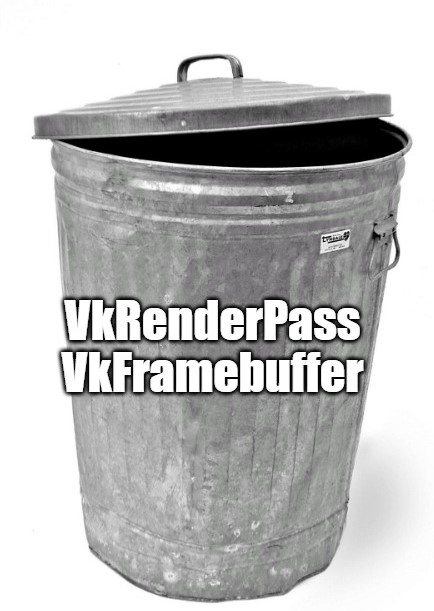

[动态渲染（dynamic rendering）](https://www.khronos.org/registry/vulkan/specs/1.2-extensions/man/html/VK_KHR_dynamic_rendering.html)是[两个月前被刚刚推出](https://www.khronos.org/blog/streamlining-render-passes)的一个新的Vulkan扩展。
有了它，我们在Vulkan中可以省去创建渲染通道对象（`VkRenderPass`）以及帧缓冲存储器对象（`VkFramebuffer`）的代码。

<div class="right-image-container">
  
</div>

在动态渲染被推出以前，为了写一个Vulkan渲染器，我们总是需要创建渲染通道对象。
渲染通道的API并不容易使用，我们也通常不需要使用多个子通道（subpasses）或者是多个输入附件（input attachments）。
相比之下，DirectX 12 API将渲染通道作为一个可选项。只有当程序员需要对某些特定移动设备进行优化时才会使用。

最近，我开始在Rust中使用[ash crate](https://github.com/MaikKlein/ash)从头开始编写一个新的Vulkan渲染器，
我也很自然地想要试试这个新的动态渲染扩展。
现在关于这个扩展的在线资源还很少，也没有关于使用它的教程。
我最后选择直接阅读[动态渲染扩展的技术规范](https://www.khronos.org/registry/vulkan/specs/1.2-extensions/man/html/VK_KHR_dynamic_rendering.html)。

我写这篇教程，希望能够让这个扩展被更多的人所了解与掌握。
为了使文章有更广泛的受众，我使用了Vulkan C API而不是Rust binding来写这篇教程。
我使用的Rust `ash` crate和Vulkan C API有非常明确的一一对应关系，
但是尽管如此，如果我在“翻译”Rust代码到C++的过程中犯了什么错误，请联系我让我知道。

## 初始化动态渲染

VK_KHR_dynamic_rendering是一个设备（device）扩展，所以我们在创建设备时需要把它和其他诸如`VK_KHR_swapchain`的设备扩展一起开启。

### 检查在你的GPU是否支持动态渲染扩展

像所有其他扩展一样，我们可以通过`vkEnumerateDeviceExtensionProperties`检查我们的物理设备是否支持`VK_KHR_dynamic_rendering`。
如果我们从`vkEnumerateDeviceExtensionProperties`得到的结果不包含`VK_KHR_dynamic_rendering`，我们需要更新显卡驱动程序以及[Vulkan SDK和运行时库（runtime）](https://vulkan.lunarg.com/sdk/home)。

**注意**：在我写这篇文章的时候（2021年1月），`VK_KHR_dynamic_rendering`才刚刚被发表没多久，所以有可能你显卡上的最新驱动仍然不支持它。
当我写这篇文章时，我甚至需要为我的Nvidia显卡安装一个[“Vulkan测试版驱动”](https://developer.nvidia.com/vulkan-driver)，不过现在已经不需要了。

### 加载动态渲染扩展

现在，在我们创建逻辑设备之前，我们需要将`VK_KHR_dynamic_rendering`添加到我们的扩展列表中：

```cpp
std::vector<const char*> device_extensions = {
  // ...,
  "VK_KHR_dynamic_rendering"
};
```

此外，动态渲染被藏在一个特性切换后面，所以我们需要创建一个`VkPhysicalDeviceDynamicRenderingFeaturesKHR`结构，然后在创建逻辑设备时将其传递给`pNext`链表：

```cpp
constexpr VkPhysicalDeviceDynamicRenderingFeaturesKHR dynamic_rendering_feature {
    .sType = VK_STRUCTURE_TYPE_PHYSICAL_DEVICE_DYNAMIC_RENDERING_FEATURES_KHR,
    .dynamicRendering = VK_TRUE,
};

const VkDeviceCreateInfo device_create_info = {
    .sType = VK_STRUCTURE_TYPE_DEVICE_CREATE_INFO,
    .pNext = &dynamic_rendering_feature,
    // ...
    .enabledExtensionCount = static_cast<unsigned int>(device_extensions.size()),
    .ppEnabledExtensionNames = device_extensions.data(),
};
```

<span class="side-note">

如果你使用C++来学习Vulkan的话，你可以试试使用[vk-bootstrap](https://github.com/charles-lunarg/vk-bootstrap)库。
它会让Vulkan初始化的过程简单许多。

</span>

## 在命令缓冲区（command buffer）中使用动态渲染

在你的Vulkan渲染器中，你的命令缓冲区录制中很可能有类似以下的代码：

```cpp
VK_CHECK(vkBeginCommandBuffer(command_buffer, &command_buffer_begin_info));

VkRenderPassBeginInfo render_pass_begin_info = {
    // ...
};

vkCmdBeginRenderPass(command_buffer, &render_pass_begin_info, VK_SUBPASS_CONTENTS_INLINE);

// Draw calls here

vkCmdEndRenderPass(command_buffer);

VK_CHECK(vkEndCommandBuffer(command_buffer));
```

有了动态渲染，我们需要替换`VkRenderPassBeginInfo`结构以及`vkCmdBeginRenderPass`和`vkCmdEndRenderPass`调用。
我们使用[`VkRenderingInfoKHR`](https://www.khronos.org/registry/vulkan/specs/1.2-extensions/man/html/VkRenderingInfoKHR.html)结构来取代`VkRenderPassBeginInfo`，它看起来如下：

```cpp
typedef struct VkRenderingInfoKHR {
    VkStructureType                        sType;
    const void*                            pNext;
    VkRenderingFlagsKHR                    flags;
    VkRect2D                               renderArea;
    uint32_t                               layerCount;
    uint32_t                               viewMask;
    uint32_t                               colorAttachmentCount;
    const VkRenderingAttachmentInfoKHR*    pColorAttachments;
    const VkRenderingAttachmentInfoKHR*    pDepthAttachment;
    const VkRenderingAttachmentInfoKHR*    pStencilAttachment;
} VkRenderingInfoKHR;
```

你可以看到例如`renderArea`的某一些字段是在之前被提供给`VkRenderPassBeginInfo`。
不过这个结构体所需大部分信息的来源都是原用于创建渲染通道的。
尤其是，我们有这个新的[`VkRenderingAttachmentInfoKHR`](https://www.khronos.org/registry/vulkan/specs/1.2-extensions/man/html/VkRenderingAttachmentInfoKHR.html)结构体用以取代`VkAttachmentDescription`来描述附件（attachment）：

```cpp
typedef struct VkRenderingAttachmentInfoKHR {
    VkStructureType          sType;
    const void*              pNext;
    VkImageView              imageView;
    VkImageLayout            imageLayout;
    VkResolveModeFlagBits    resolveMode;
    VkImageView              resolveImageView;
    VkImageLayout            resolveImageLayout;
    VkAttachmentLoadOp       loadOp;
    VkAttachmentStoreOp      storeOp;
    VkClearValue             clearValue;
} VkRenderingAttachmentInfoKHR;
```

现在我们可以使用上述结构体来取代我们之前的渲染通道相关代码。
这一变化确实意味着我们将在命令缓冲区的录制中写更多的代码，但这是因为我们将一部分原来放在渲染通道创建的代码移到了这里：

```cpp
VK_CHECK(vkBeginCommandBuffer(command_buffer, &command_buffer_begin_info));

const VkRenderingAttachmentInfoKHR color_attachment_info {
    .sType = VK_STRUCTURE_TYPE_RENDERING_ATTACHMENT_INFO_KHR,
    .imageView = swapchain_image_views_[swapchain_image_index_],
    .imageLayout = VK_IMAGE_LAYOUT_ATTACHMENT_OPTIMAL_KHR,
    .loadOp = VK_ATTACHMENT_LOAD_OP_CLEAR,
    .storeOp = VK_ATTACHMENT_STORE_OP_STORE,
    .clearValue = clear_value,
};

const VkRenderingInfoKHR render_info {
    .sType = VK_STRUCTURE_TYPE_RENDERING_INFO_KHR,
    .renderArea = render_area,
    .layer_count = 1,
    .colorAttachmentCount = 1,
    .pColorAttachments = &color_attachment_info,
};

vkCmdBeginRenderingKHR(command_buffer, &render_info);

// Draw calls here

vkCmdEndRenderingKHR(command_buffer);

VK_CHECK(vkEndCommandBuffer(command_buffer));
```

## 管线（Pipeline）创建

现在，我们可以删除所有创建渲染通道（render pass）以及帧缓冲存储器（framebuffer）的代码了！
然后，在创建渲染管线时，我们不用向管线提供相应的渲染通道参数，但我们需要提供一个[`VkPipelineRenderingCreateInfoKHR`](https://www.khronos.org/registry/vulkan/specs/1.2-extensions/man/html/VkPipelineRenderingCreateInfoKHR.html)对象来描述附件信息：

```cpp
const VkPipelineRenderingCreateInfoKHR pipeline_rendering_create_info {
    .sType = VK_STRUCTURE_TYPE_PIPELINE_RENDERING_CREATE_INFO_KHR
    .colorAttachmentCount = 1,
    .pColorAttachmentFormats = &swapchain_image_format_,
};

const VkGraphicsPipelineCreateInfo pipeline_create_info {
  // ...
  .pNext = &pipeline_rendering_create_info,
  // ...
  .renderPass = nullptr, // We no longer need a render pass
  // ...
};
```

## 图像布局转换 (Image layout transition)

如果一切都那么简单，我就会对这个扩展非常满意。
但是事实上render pass对象的确为我们做了一些有用的事。

在我们现在的代码下，每帧验证层（validation layer）都会产生如下的警报：

> pSwapchains[0] images passed to present must be in layout VK_IMAGE_LAYOUT_PRESENT_SRC_KHR or VK_IMAGE_LAYOUT_SHARED_PRESENT_KHR but is in VK_IMAGE_LAYOUT_UNDEFINED. The Vulkan spec states: Each element of pImageIndices must be the index of a presentable image acquired from the swapchain specified by the corresponding element of the pSwapchains array, and the presented image subresource must be in the VK_IMAGE_LAYOUT_PRESENT_SRC_KHR layout at the time the operation is executed on a VkDevice (https://github.com/KhronosGroup/Vulkan-Docs/search?q=VUID-VkPresentInfoKHR-pImageIndices-01296)

验证层的意思是，我们现在的交换链(swapchain)图像处于`VK_IMAGE_LAYOUT_UNDEFINED`布局，但是为了展示图像，它的布局必须为`VK_IMAGE_LAYOUT_PRESENT_SRC_KHR`或者是`VK_IMAGE_LAYOUT_SHARED_PRESENT_KHR`。

我们可以手动在展示前将交换链图像的布局转换转化至`VK_IMAGE_LAYOUT_PRESENT_SRC_KHR`：

```cpp
// draw calls here

vkCmdEndRenderingKHR(command_buffer);

const VkImageMemoryBarrier image_memory_barrier {
    .sType = VK_STRUCTURE_TYPE_IMAGE_MEMORY_BARRIER,
    .srcAccessMask = VK_ACCESS_COLOR_ATTACHMENT_WRITE_BIT,
    .oldLayout = VK_IMAGE_LAYOUT_COLOR_ATTACHMENT_OPTIMAL,
    .newLayout = VK_IMAGE_LAYOUT_PRESENT_SRC_KHR,
    .image = swapchain_images[swapchain_image_index_],
    .subresourceRange = {
      .aspectMask = VK_IMAGE_ASPECT_COLOR_BIT,
      .baseMipLevel = 0,
      .levelCount = 1,
      .baseArrayLayer = 0,
      .layerCount = 1,
    }
};

vkCmdPipelineBarrier(
    command_buffer,
    VK_PIPELINE_STAGE_COLOR_ATTACHMENT_OUTPUT_BIT,  // srcStageMask
    BOTTOM_OF_PIPE, // dstStageMask
    0,
    0,
    nullptr,
    0,
    nullptr,
    1, // imageMemoryBarrierCount
    &image_memory_barrier // pImageMemoryBarriers
);

VK_CHECK(vkEndCommandBuffer(command_buffer));
```

但是现在我们在渲染下一帧前必须将交换链图像从`VK_IMAGE_LAYOUT_PRESENT_SRC_KHR`的布局转换回`VK_IMAGE_LAYOUT_COLOR_ATTACHMENT_OPTIMAL`：

```cpp
VK_CHECK(vkBeginCommandBuffer(command_buffer, &command_buffer_begin_info));

const VkImageMemoryBarrier image_memory_barrier {
    .sType = VK_STRUCTURE_TYPE_IMAGE_MEMORY_BARRIER,
    .dstAccessMask = VK_ACCESS_COLOR_ATTACHMENT_WRITE_BIT,
    .oldLayout = VK_IMAGE_LAYOUT_UNDEFINED,
    .newLayout = VK_IMAGE_LAYOUT_COLOR_ATTACHMENT_OPTIMAL,
    .image = swapchain_images[swapchain_image_index_],
    .subresourceRange = {
      .aspectMask = VK_IMAGE_ASPECT_COLOR_BIT,
      .baseMipLevel = 0,
      .levelCount = 1,
      .baseArrayLayer = 0,
      .layerCount = 1,
    }
};

vkCmdPipelineBarrier(
    command_buffer,
    VK_PIPELINE_STAGE_TOP_OF_PIPE_BIT,  // srcStageMask
    VK_PIPELINE_STAGE_COLOR_ATTACHMENT_OUTPUT_BIT, // dstStageMask
    0,
    0,
    nullptr,
    0,
    nullptr,
    1, // imageMemoryBarrierCount
    &image_memory_barrier // pImageMemoryBarriers
);

// begin dynamic rendering here

// draw calls
```

几乎所有的Vulkan渲染器都有辅助函数来简化这些图像布局转换代码，但即便如此要指定所有的图像转换参数还是挺麻烦的。
对于深度缓冲（depth buffer）以及模版缓冲（stencil buffer），我们也需要进行类似的图像布局转换。

## 最后的话

在这个简单的情况下，动态渲染扩展似乎和创建渲染通道以及帧缓冲存储器对象一样繁琐。
不过在multi-pass渲染中，因为同步（Synchronization）的复杂度，动态渲染可能会变得更有价值。
Khronos也可能在未来将动态渲染扩展改善地更容易使用。

## 致谢

特别感谢我的朋友[Charles Giessen](https://github.com/cdgiessen)对这篇文章的校对和编辑!

除此之外，在这篇文章发布后，许多资深图形程序员也提供了宝贵的见解和反馈。
