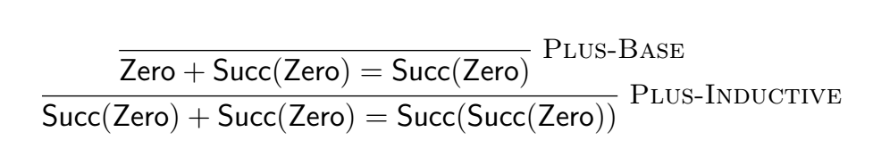

在编程语言研究领域中似乎充满了行话、希腊字母和怪异的符号。
这些惯例使得论文更加简洁，但同时也非常难以理解。
由于我正在学习[编程语言基础](https://csci5535.cs.colorado.edu/s20/)的课程，
我想在一系列博客文章中分享我学到的关键概念。

编程语言领域中的许多数学概念都源自[命题逻辑](https://zh.wikipedia.org/wiki/%E5%91%BD%E9%A2%98%E9%80%BB%E8%BE%91)的领域，而今天我们的主题是**判断(Judgement）**与**推理规则(Inference Rules)**的形式语言。

## 判断（Judgements）

我们使用判断来断言某个命题的真假。以下是我们在判断中常用的一些符号[^1]：

[^1]: Robert Harper. _Practical Foundations for Programming Languages_. Cambridge University Press, Cambridge, England, Second edition, 2016.

$$
\begin{aligned}
n \ \text{nat} && \text{$n$是自然数} \\
n_1 + n_2 = n && \text{$n$是$n_1$与$n_2$的和} \\
\tau \ \text{type} && \text{$\tau$是一个类型} \\
e : \tau && \text{表达式$e$求值后的值的类型是$\tau$} \\
e \Downarrow v && \text{表达式$e$求值到值$v$}
\end{aligned}
$$

在上面的例子中$n \ \text{nat}$是一个未知变量。
我们把这种带有未知变量的判断叫做**判断形式（judgement forms）**，
然后我们通过把值带入判断形式来得到判断：

$$
\begin{aligned}
0 &\ \text{nat} \\
1 &\ \text{nat} \\
-1 &\ \text{nat} \\
\text{``Hello, world!''} &\ \text{nat}
\end{aligned}
$$

如我们所见，判断既可以是正确的，也可能完全是错的。
你可以把它理解成是一个返回布尔值的函数调用。

## 推理规则（Inference Rules）

推理规则是一种从**前提**判断得到**结论**判断的逻辑形式。
它们通常具有以下的标准格式：

$$
\frac{\text{premise1} \quad \text{premise2} \quad \cdots}{ \text{conclusion} }
$$

你可以将它们读为“如果满足所有前提，则结论将被满足”。

让我们通过推理规则来归纳定义（inductively define）自然数。

$$
\frac{}{\text{zero} \ \text{nat} }
$$

$$
\frac{a  \ \text{nat}}{\text{Succ}(a) \ \text{nat} }
$$

在此推理规则中，我们定义自然数要么为零，要么是一系列其他自然数。
我们把没有任何前提的规则（例如第一个规则）称为*公理*（axoim）。

因为使用推理规则来定义语法（syntax）过于冗长，我们会使用简化的[**文法（grammar）**](https://zh.wikipedia.org/wiki/%E5%BD%A2%E5%BC%8F%E6%96%87%E6%B3%95)格式来描述语法。例如，对于自然数，我们可以将其描述为

<aside style="margin-top: -60px;">

如果你可以流畅的阅读英文，看英文版的技术书籍会更有优势。至少你不用面对如此奇葩的翻译（语法 vs 文法 😂）。

</aside>

$$
\text{\textbf{nat}} ::= \text{Zero} | \text{Succ}(\textbf{nat})
$$

不过推理规则是一个更加普适的语言，因为它可以表达的不仅仅是语法。
比方说，我们可以用推理规则来定义自然数的$+$运算符的**语义（semantics）**：

$$
\frac{n: \text{\textbf{nat}}}{\text{Zero} + n \Downarrow n} (\text{Plus-Base})
$$

$$
\frac{n_1: \text{\textbf{nat}} \quad n_2: \text{\textbf{nat}} \quad n_1 + n_2 \Downarrow n}{\text{Succ}(n_1) + n_2 \Downarrow \text{Succ}(n)} (\text{Plus-Inductive})
$$

我们还可以通过推理规则定义自然数的更多操作，例如$-$以及$\times$。
让我们看另一个例子，一个自然数的单链表：

$$
\text{\textbf{list}} ::= \text{Nil} | \text{Cons}(\textbf{nat}, \textbf{list})
$$

以上的文法的意思是，我们的链表$\text{\textbf{list}}$要么是$\text{Nil}$，要么是一个拥有单个元素以及对子链表的引用的$\text{Cons}$单元。

<aside style="margin-top: -50px;">

编程语言[Lisp](https://zh.wikipedia.org/wiki/LISP)发明了使用“cons”一词的传统。
在 Lisp 中，`cons`可以被理解为构造函数。
因为 List 动态类型的特点，`cons`在 Lisp 中的用途比我们的定义要广阔得多。

</aside>

现在我们可以用推理规则来给我们的链表$\text{\textbf{list}}$定义操作。
例如，我们可以定义一个`head`函数来获取链表的第一个元素：

$$
\frac{l = \text{Cons}(\text{hd}, \text{tl})}{\text{head}(l) \Downarrow \text{hd}} (\text{head-Cons})
$$

## 导出树（Derivation)

我们可以轻易地给出错误的判断，例如$\text{Succ(Zero)} \Downarrow \text{Zero}$。
因此，我们需要一种办法来证明判断的正确性，
，而**导出树**就是一种证明判断方法。

导出树总是从公理开始一直到我们要证明的判断结束。
对于每个步骤，我们将推理规则应用于先前的判断。

比方说如果你要证明我们对自然数的定义满足“1 + 1 = 2”，你可以按照如下来写：



如果从下到上阅读导出树，你会发现导出树与程序的运行过程非常类似：

```ocaml
Succ(Zero) + Succ(Zero)
= Zero + Succ(Succ(Zero))
= Succ(Succ(Zero))
```

因为`+`运算是一个**纯函数（pure function）**,我们可以通过替换法来追溯`+`运算的运行。
纯函数的意思是

- 在同样的输入下，`+`总是产生同样的输出
- `+`语义上没有可观察的函数副作用（side effect）

<aside style="margin-top: -60px;">

如果您考虑“实现细节”（例如寄存器以及内存的变动），
那么没有任何的在机器上运行的“函数”是纯函数。
不过这无助于我们的讨论。
一定程度的抽象不仅可以帮助你的理解，
而且还有助于编译器针对纯函数进行优化。

</aside>

## 数学概念与编程的联系

我们讨论的所有数学符号都有相应的在编程语言中的构造。
下表是数学符号和编程之间的一个比较：

| 数学语言 | 编程语言中的实现         |
| -------- | ------------------------ |
| 判断形式 | 一个返回`bool`的函数声明 |
| 判断     | 函数调用                 |
| 推理规则 | 函数体                   |
| 导出树   | 程序运行                 |

假设我们有一个判断形式$l \Downarrow e$，我们可以把它写作函数声明

```ocaml
val head : (l: nat list, e: option(nat)) -> bool
```

而`head`的推理规则则可以被看作是这个函数的内容。

$$
\frac{}{\text{head}(\text{Nil}) \Downarrow \text{Nothing}} (\text{head-Nil})
$$

$$
\frac{l = \text{Cons}(\text{hd}, \text{tl})}{\text{head}(l) \Downarrow \text{Something(hd)}} (\text{head-Cons})
$$

```ocaml
let head (l : nat list, e: option(nat)) =
  match l with
  | [] -> false
  | hd::_ -> hd = e
```

例如$\text{head(Cons(Succ(Zero), Nil))} \ \text{Succ(Zero)}$的判断就类似于对函数的调用例如：

```ocaml
head Cons(Succ(Zero), Nil) Succ(Zero)  (*true*)
```

在如上我使用[OCaml](https://ocaml.org/)作为例子，但是这种比较适用于任何编程语言。使用 OCaml 这样的 ML 系列语言的优势在于对例如`nat`或者`list`这种归纳定义类型的支持。

对数学定义的字面翻译会产生非常低效的代码。在一个实际的解释器程序中，你可能会将`head`函数写为：

```ocaml
let head (l : nat list) =
  match l with
  | [] -> None
  | hd::_ -> Some(hd)
```

不过，把数学语言与程序语言进行这种字面上的比较仍然有助于对概念的理解。

### 判断中的“类型错误”

在编写判断与推理规则时我们有时很容易会犯下“类型错误”。
例如，以下推理规则是不正确的。因为`+`不是自然数，我们不能将其放在`Succ`中。

$$
\frac{n_1: \text{\textbf{nat}} \quad n_2: \text{\textbf{nat}}}{\text{Succ}(n_1) + n_2 \Downarrow \text{Succ}(n_1 + n_2)} (\text{Bogus-Plus-Inductive})
$$

在编写解释器代码的时候同样很容易犯把抽象语法和值混用这种错误。
如果您使用的是静态类型（static typed）的语言，则编译器会在编译期报告类型的错误。
相反，在书写判断与推理规则时你不可能获得任何自动化得帮助。
因此，建立一个自己心中的“类型检查器”有助于正确地编写推理规则。

## 总结

判断与推理规则是编程语言正式定义的基本组成部分，
几乎所有的编程语言相关的论文都离不开它们。
因此，可以读懂、书写、证明这种形式语言的能力是非常重要的。
