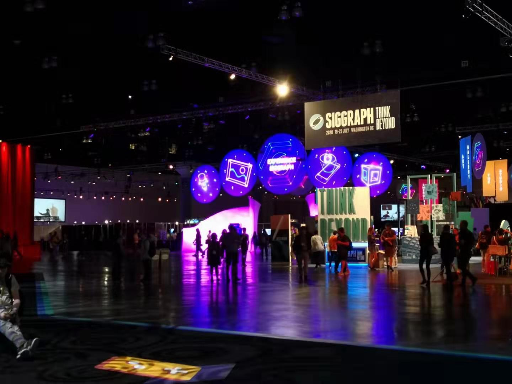

This year, several of the coworkers and I at [Trimble SketchUp](https://www.sketchup.com/) attended ACM [Special Interest Group in Graphics (Siggraph) conference](https://s2019.siggraph.org/). It is my first time attending such a big gathering. The week is exciting, exhaustion, and also extremely rewarding for me.

  

This year the conference location is Los Angeles, so we had the chance to have a tour to the pier, taste different seafood, and watch the sunset. We also had nerdy jokes about the pier floor is just a displacement map, and the sunset can be rendered by some [shader hack](https://www.shadertoy.com/view/Ml2cWG).

## Ray Tracing on Sunday
The spotlight of this year's Siggraph is still ray tracing after Nvidia announce their [Geforce RTX](https://www.nvidia.com/en-us/geforce/20-series/) GPUs with ray-tracing capacity a year ago.

As a [ray-tracing](https://en.wikipedia.org/wiki/Ray_tracing_(graphics)) fanatic, I am glad to see the technology I like becomes more and more popular. It is said that "ray tracing is not slow; it is the computers." Fortunately, we are just entering this revolution that, for the first time, computers are fast enough to do serious ray tracing works in real-time. I spent the whole Sunday on Ray-tracing related sessions. The session on the morning "[*Are We Done With Ray Tracing?*](https://sites.google.com/view/arewedonewithraytracing)." Spoiler alert, as you may expect, the answer is obviously no. The area is still a warm bed of new researches. Further, with the advent of real-time ray-tracing, new challenges arose like denoising on images generated by very-low sample size, effectively updating of acceleration structures.

Different speakers had different vision of how fast the ray-tracing adoption will be. [Morgan McGuire](https://casual-effects.com/morgan/index.html) of Nvidia thinks that ray-tracing pipeline will become mainstream in real-time graphics in 5 years. By contrast, [Colin Barré-Brisebois](https://colinbarrebrisebois.com) for EA is much more conservative, considering rasterization/ray-tracing hybrid rendering-pipeline will be the future for a long time. I am more aligned with the latter opinion because ray-tracing are still much more expensive, and the hybrid approaches are already producing amazing results. To be honest, as long as we do not adopt a full-blown path-tracing approach (which still have prohibitive cost for current large real-time applications), I don't think produced graphics quality of single real-tracing pipeline or rasterization will have a big difference. However, ray-tracing may introduce maintainance gain, especially for small teams and projects, since a completely ray-tracing pipeline will drastically decrease the complexity of current beastly graphics pipeline. I attended *Introduction to Real-Time Ray Tracing* afternoon, which was on the same topic but covered more basic and detailed material, from [Peter Shirley](https://research.nvidia.com/person/peter-shirley)'s ray tracing introduction to how to write a simple DirectX ray-tracing program.

## Monday: Advances in Real-Time Rendering, Keynote, and Animated Shorts
My colleges and I spent most of the Monday attending "[*Advances in Real-Time Rendering in Games*](http://advances.realtimerendering.com/s2019/index.htm)" part 1. It is astonishing how many crazy new methods in real-time rendering get developed, from strand-based hair rendering to ocean wave simulation. There are just too many goodies for me to justify them all.

The [Electronic Theater](https://s2019.siggraph.org/conference/programs-events/computer-animation-festival/electronic-theater/) at night was a fun event. We saw a lot of great works of animation artists this year. However, All of us felt that this year's demos have overly depressing and emotional themes in general. There were excessively too many aminations focuses on the loneliness in an industrial society or the evil side of human nature.

## Tuesday: Vulkan, Ray Tracing Roundtable
On Tuesday we went to [*Best Practices for Using and Contributing to the Vulkan Validation Layers*](https://www.lunarg.com/wp-content/uploads/2019/07/LunarG-Validation-Layer-BoF.pdf) and [*Vulkan SDK Update and Community Feedback*](https://www.lunarg.com/wp-content/uploads/2019/07/LunarG-SDK-BoF.pdf) from [LunarG](https://www.lunarg.com/) on Vulkan SDK. I am still very new to Vulkan, but I am impressed about how much work LunarG folks put into the SDK to make using Vulkan a better experience.

I also went to the Ray Tracing Roundtable organized by [Eric Haines](https://erich.realtimerendering.com/). People interested in ray tracing gathered in small groups and talked about news and advancement of ray tracing. It was an astounding experience that people like me could chat with heroes in the field face to face.

## Wednesday and Thursday

I have an ambition of making the [CU Computer Graphics Group](https://cu-computer-graphics-group.netlify.com/) a Siggraph chapter, so I went to *ACM SIGGRAPH Chapters Fast Forward and Startup Meeting* Wednesday morning. I then went to [*An Introduction to Physics-Based Animation*](https://s2019.siggraph.org/presentation/?id=gensub_171&sess=sess193) afternoon, which compressed semester-worth materials into three and a half hours. On Thursday morning I went to *Differentiable Graphics With Tensorflow 2.0*. The idea of Differentiable Rendering sounds exciting, and it is always good to see applications of machine learning in graphics beyond denoising. Nevertheless, I felt that it is hard for me to come up with a useful use case for it. Maybe I need to delve into this technique more in the future.

## Exhibition

  

Various companies have exhibitions and live demos in Siggraph. As with everything else, a lot of excitement around the exhibition is related to real-time ray-tracing. There were a lot of companies that demonstrated their motion capture techniques and streamed the results into a game engine. One of the particularly striking shops implemented a VR avatar that will always have eye contact with you after you move.

## Conclusion: An inspiring year to learn Graphics
The conference itself is just five days, but it leaves me with year-worth materials to learn. I took notes on several new technologists and libraries to play and more than ten papers that I want to read. Also, due to time conflict, I can't attend all the sessions that I am interested in. There are still several intriguing talks and workshops I want to watch afterward, including *A Fast Forward through Ray Tracing Gems*, *Optimizing and Deploying Ray-Traced Dynamic Global Illumination*, *Open Problems in Real-Time Rendering*, [*Path Tracing in Production*](https://jo.dreggn.org/path-tracing-in-production/2019/index.html), *Ray Tracing Gems 1.1*, and [*My Favorite Samples*](https://sites.google.com/view/myfavoritesamples).
